<picture>
  <source media="(max-width: 600px)" srcset="./assets/profile-banner-mobile.svg" />
  
</picture>

<h1>Lukman Bijak Bestari</h1>

<strong>Trainer Accurate Online · Developer Sistem Bisnis</strong>

Saya membantu tim menyambungkan sistem, merapikan data, dan menyederhanakan pekerjaan operasional.

<a href="#what-i-build">Solusi</a> &nbsp;·&nbsp; <a href="#how-i-work">Proses</a> &nbsp;·&nbsp; <a href="#github-highlights">GitHub</a> &nbsp;·&nbsp; <a href="#lets-connect">Kontak</a>

## About Me

Saya **Lukman Bijak Bestari**, trainer dan developer yang menghubungkan proses bisnis, sistem akuntansi, data, dan pengembangan aplikasi. Fokus saya adalah mengubah kebutuhan operasional menjadi solusi digital yang praktis dan mudah digunakan tim.

Keahlian utama saya mencakup **pelatihan dan implementasi Accurate Online**, **integrasi REST API**, **otomatisasi proses bisnis**, serta **pengolahan data dan pelaporan dengan Excel dan SQL**.

## What I Build

Saya membangun solusi yang mengikuti **alur kerja, data, dan kebutuhan tim Anda**.

<h3>Business Applications</h3>

Aplikasi web khusus untuk mengelola aktivitas operasional dalam satu alur kerja yang terstruktur.

<code>Sales &amp; purchasing</code> <code>Inventory</code> <code>Approvals</code>

<strong>Manfaat:</strong> Membantu tim menjalankan pekerjaan harian dengan alur yang jelas.

<h3>Accurate Online Integrations</h3>

Hubungkan Accurate Online dengan aplikasi bisnis, file Excel, dan platform lain melalui API.

<code>REST API</code> <code>Data synchronization</code> <code>Excel integration</code>

<strong>Manfaat:</strong> Menjaga data tetap terhubung dan mengurangi input berulang.

<h3>Reporting &amp; Dashboards</h3>

Ubah data operasional dan keuangan menjadi laporan serta dashboard untuk mendukung keputusan sehari-hari.

<code>Financial reports</code> <code>Operational monitoring</code> <code>Analytics</code>

<strong>Manfaat:</strong> Mempermudah pemantauan kinerja dan penentuan tindak lanjut.

<h3>Data Processing Tools</h3>

Tools untuk memvalidasi, merekonsiliasi, mengonversi, dan memindahkan data bisnis antar sistem.

<code>Validation</code> <code>Reconciliation</code> <code>Import / export</code>

<strong>Manfaat:</strong> Menyiapkan data yang konsisten untuk proses bisnis.

<h3>Workflow Automation</h3>

Satukan aplikasi, integrasi, dan pengolahan data melalui tugas terjadwal serta aturan validasi.

<code>Scheduled synchronization</code> <code>Automated reporting</code> <code>Process automation</code>

<strong>Manfaat:</strong> Mengurangi pekerjaan manual agar tim dapat fokus pada pengambilan keputusan.

## How I Work

<picture>
  <source media="(max-width: 600px)" srcset="./assets/workflow-mobile.svg" />
  
</picture>

1. **Pahami proses** - petakan kebutuhan, alur kerja, dan sumber data.
2. **Hubungkan sistem** - susun struktur data dan integrasi yang sesuai.
3. **Otomatisasi pekerjaan** - terapkan validasi dan kurangi langkah berulang.
4. **Evaluasi hasil** - gunakan laporan serta masukan tim untuk perbaikan.

## Tech Stack

**Pengembangan aplikasi**

PHP, Laravel, JavaScript, HTML, CSS

**Data & pelaporan**

MySQL, PostgreSQL, SQL, Microsoft Excel, JasperReports

**Integrasi**

Accurate Online API, REST API, JSON, CSV

**Infrastruktur & workflow**

Linux, Nginx, Git, GitHub, Vercel

## GitHub Highlights

Ringkasan kontribusi dan repositori publik. Waktu pembaruan terakhir tertera pada kartu.

<a href="https://github.com/lukmanbijak93-blip">
  <picture>
    <source media="(max-width: 600px)" srcset="https://raw.githubusercontent.com/lukmanbijak93-blip/lukmanbijak93-blip/output/github-highlights-mobile.svg" />
    
  </picture>
</a>

### Contribution Snake

Animasi berdasarkan kalender kontribusi GitHub saya.

<!-- contribution-snake:start -->
<picture>
  <source media="(prefers-color-scheme: dark)" srcset="https://raw.githubusercontent.com/lukmanbijak93-blip/lukmanbijak93-blip/output/github-contribution-grid-snake-dark.svg" />
  
</picture>
<!-- contribution-snake:end -->

Kartu diperbarui otomatis setiap 30 menit. GitHub dapat menunda workflow atau menyimpan gambar dalam cache, sehingga angka pada kartu tidak selalu berubah saat halaman dibuka. Untuk aktivitas terkini, buka [kalender kontribusi langsung di GitHub](https://github.com/lukmanbijak93-blip?tab=overview). Streak memakai tanggal kalender GitHub (UTC); kontribusi privat bergantung pada visibilitas akun.

[Jelajahi repositori](https://github.com/lukmanbijak93-blip?tab=repositories) · [Aktivitas terbaru](https://github.com/lukmanbijak93-blip?tab=overview) · [Status pembaruan kartu](https://github.com/lukmanbijak93-blip/lukmanbijak93-blip/actions/workflows/snake.yml)

## Let's Connect

**Ingin mengintegrasikan Accurate Online atau menyederhanakan proses bisnis Anda?**

Ceritakan alur kerja yang sedang Anda jalankan dan bagian yang ingin diperbaiki. Kita bisa mulai dari kebutuhan integrasi, otomatisasi, pelaporan, atau pelatihan tim.

[Diskusikan kebutuhan Anda lewat WhatsApp](https://wa.me/6281285525538) - [Instagram @lukmanbi](https://www.instagram.com/lukmanbi) - [Website EasyFinancePro](https://easyfinancepro.id/)
