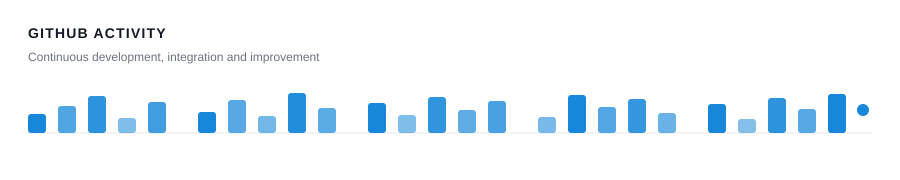

<div align="center">

<p align="center"><strong>Lukman Bijak Bestari</strong></p>

<p><strong>BUSINESS SYSTEMS • DATA • AUTOMATION</strong></p>


<p>
  <a href="https://easyfinancepro.id/">
    
  </a>
  <a href="https://github.com/lukmanbijak93-blip">
    
  </a>
</p>

**Build systems that make business processes simpler, faster, and measurable.**

</div>

---

<p><strong> ABOUT ME</strong></p>

Hi, I'm **Lukman Bijak Bestari** — a trainer, developer, and business systems builder focused on transforming operational workflows into practical digital solutions.

My work sits at the intersection of **business processes, accounting systems, data, and software development**.

I regularly work with:

- **Accurate Online** implementation, training, API integration, and automation
- **Business application development** for operational and financial workflows
- **Excel & SQL** for reporting, reconciliation, data processing, and analytics
- **REST API integrations** between internal systems and third-party platforms
- **Dashboard & reporting systems** that turn operational data into useful information

> `Understand the process → structure the data → automate the workflow → improve continuously.`

---

<p><strong> CORE EXPERTISE</strong></p>

<table>
<tr>
<td width="50%" valign="top">

<p><strong> Business Systems</strong></p>

Designing practical systems for real-world workflows.

`ERP Integration`  
`Sales & Purchase Workflow`  
`Budgeting System`  
`Approval Workflow`  
`Inventory`  
`HR & Payroll`  
`Operational Monitoring`

</td>
<td width="50%" valign="top">

<p><strong> Automation & Integration</strong></p>

Connecting systems and reducing repetitive work.

`Accurate Online API`  
`REST API`  
`Data Synchronization`  
`Excel Import / Export`  
`Automated Reporting`  
`Business Process Automation`

</td>
</tr>

<tr>
<td width="50%" valign="top">

<p><strong> Data & Reporting</strong></p>

Turning raw operational data into useful information.

`SQL`  
`Microsoft Excel`  
`Data Reconciliation`  
`Financial Reports`  
`Operational Dashboard`  
`Data Validation`

</td>
<td width="50%" valign="top">

<p><strong> Training & Implementation</strong></p>

Helping teams understand and adopt systems effectively.

`Accurate Online Training`  
`System Implementation`  
`User Training`  
`Process Mapping`  
`Troubleshooting`  
`Continuous Improvement`

</td>
</tr>
</table>

---

<p><strong> TECH STACK</strong></p>

<p><strong>Development</strong></p>

<p>

</p>

<p><strong>Database & Data</strong></p>

<p>

</p>

`MySQL` &nbsp;•&nbsp; `PostgreSQL` &nbsp;•&nbsp; `SQL` &nbsp;•&nbsp; `Microsoft Excel` &nbsp;•&nbsp; `CSV / Data Processing`

<p><strong>Business & Integration</strong></p>

<p>


</p>

<p><strong>Infrastructure</strong></p>

<p>

</p>

`Linux Server` &nbsp;•&nbsp; `Nginx` &nbsp;•&nbsp; `SSL` &nbsp;•&nbsp; `Git Deployment` &nbsp;•&nbsp; `Web Hosting`

---

<p><strong> WHAT I BUILD</strong></p>

<p>Practical digital solutions built around <strong>your processes, your data, and your team.</strong></p>

<table>
<tr>
<td width="50%" valign="top">

<h3>Business Applications</h3>
<p>Custom web applications that bring everyday operations into a structured, manageable workspace.</p>
<p><code>Sales &amp; purchasing</code> <code>Inventory</code> <code>Approvals</code></p>
<p><strong>Purpose:</strong> Give teams a clearer way to manage their daily work.</p>
</td>
<td width="50%" valign="top">

<h3>Accurate Online Integrations</h3>
<p>Connect Accurate Online with business applications, Excel files, and external platforms through APIs.</p>
<p><code>REST API</code> <code>Data synchronization</code> <code>Excel integration</code></p>
<p><strong>Purpose:</strong> Keep business data connected and reduce repetitive entry.</p>
</td>
</tr>
<tr>
<td width="50%" valign="top">

<h3>Reporting &amp; Dashboards</h3>
<p>Turn operational and financial data into focused reports and dashboards that support everyday decisions.</p>
<p><code>Financial reports</code> <code>Operational monitoring</code> <code>Analytics</code></p>
<p><strong>Purpose:</strong> Make performance easier to understand and act on.</p>
</td>
<td width="50%" valign="top">

<h3>Data Processing Tools</h3>
<p>Purpose-built utilities for validating, reconciling, converting, and moving business data between systems.</p>
<p><code>Validation</code> <code>Reconciliation</code> <code>Import / export</code></p>
<p><strong>Purpose:</strong> Prepare consistent, reliable data for business workflows.</p>
</td>
</tr>
<tr>
<td colspan="2" valign="top">

<h3>Workflow Automation</h3>
<p>Bring applications, integrations, and data tools together with scheduled tasks and validation rules that reduce manual handoffs.</p>
<p><code>Scheduled synchronization</code> <code>Automated reporting</code> <code>Process automation</code></p>
<p><strong>Purpose:</strong> Help teams spend less time on repetitive work and more time on decisions.</p>
</td>
</tr>
</table>

---

<p><strong> GITHUB PERFORMANCE HIGHLIGHTS</strong></p>

<div align="center">


<br/><br/>


</div>

<br/>

<p><strong><code>ACTIVITY HIGHLIGHT</code></strong></p>

<div align="center">



<br/>

</div>

---

<p><strong> CURRENT FOCUS</strong></p>

```bash
lukman@business-system:~$ status

> Building business applications
> Integrating Accurate Online
> Automating operational workflows
> Improving reporting & data quality
> Learning, testing, and shipping continuously
```

---

<p><strong> LET'S CONNECT</strong></p>

<div align="center">

<p><strong>Have a business process that should be simpler?</strong></p>

I enjoy working on solutions where **business knowledge, accounting, data, and technology** meet.

<a href="https://easyfinancepro.id/">
  
</a>
<a href="https://www.instagram.com/lukmanbi">
  
</a>
<a href="https://wa.me/6281285525538">
  
</a>

<br/><br/>

BUSINESS • DATA • AUTOMATION • CONTINUOUS IMPROVEMENT

<br/>

**Thanks for visiting my GitHub profile.**

</div>
